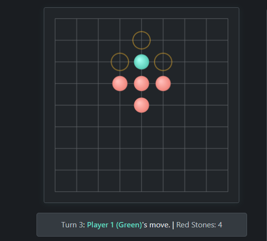

# Grid Game Simulation (Utah Math Olympiad 2014 P1)

This project is an interactive web-based simulation of the deterministic grid game presented as Problem 1 in the 2014 Utah Math Olympiad. It allows users to play the game, visualize the rules, and understand the optimal winning strategy for Player 2. The simulation includes analysis text and charts explaining the game's properties.

**[Link to Live Demo]**((https://raeef1001.github.io/-Utah-Math-Olympiad-2014-P1--Board-Game-Version/))

## Features

*   **Interactive Gameplay:** Play as Player 1 (Green) against the rules enforced for Player 2 (Red stone placement).
*   **Visual Board:** Clear representation of the 8x8 grid (9x9 intersections) and stone positions.
*   **Valid Move Highlighting:** Shows possible moves for Player 1 (Green).
*   **Game State Display:** Tracks the current turn, player, and cumulative red stone count.
*   **Win/Loss Detection:** Automatically determines the game outcome based on the rules.
*   **Restart Functionality:** Easily start a new game simulation.
*   **Integrated Analysis:** Explanation of game rules, optimal strategy, and mathematical invariants alongside the simulation.
*   **Visual Charts:** Includes charts visualizing the cumulative red stone count and the Green stone's Manhattan distance to a target corner during optimal play.

## How to Run Locally

1.  Clone this repository or download the files.
2.  Open the `index.html` file in your web browser. No server setup is required.

## Game Rules

1.  **Setup:** The game starts with a single **Green** stone at the center intersection (4,4) of an 8x8 grid (9x9 intersections).
2.  **Player 1 (Green):** On their turn:
    *   Moves the Green stone one step horizontally or vertically to an adjacent, unoccupied intersection.
    *   Immediately places a **Red** stone on the intersection they just moved *from*.
3.  **Player 2 (Red):** On their turn:
    *   Places one **Red** stone on *any* unoccupied intersection (that is not the current Green stone location).
4.  **Winning/Losing:**
    *   **Player 1 Loses (Player 2 Wins)** if Player 1 moves the Green stone onto one of the four corner intersections (0,0), (8,0), (0,8), or (8,8).
    *   **Player 2 Loses (Player 1 Wins)** if, at the start of Player 1's turn, the Green stone has no valid moves (is completely surrounded) AND the Green stone is *not* on a corner intersection.

## Analysis & Key Findings

This game, despite its simple rules, is a deterministic, perfect information game where the second player has a guaranteed winning strategy if played optimally.

*   **Player 2 Winning Strategy:** Player 2 can force Player 1 onto a chosen corner by employing a "pairing" or "forcing" strategy. After Player 1 moves towards the target corner, Player 2 places a Red stone to block Player 1's immediate retreat path along the axis of progress.
*   **Game Length:** An optimal game always concludes when Player 1 makes their 8th move, landing on a corner. This spans 7 full turns plus Player 1's final action.
*   **Red Stone Count Invariant:** Under optimal play leading to a Player 2 win, the game *always* ends with exactly **15 Red stones** on the board (8 placed automatically by Player 1 after their moves, and 7 placed strategically by Player 2). This is visualized in the "Red Stone Accumulation" chart.
*   **Distance Reduction:** Player 2's strategy ensures a consistent (though not necessarily linear) reduction in the Green stone's Manhattan distance to the target corner, visualized in the "Distance to Target Corner" chart.

## Technology Stack

*   HTML
*   CSS
*   JavaScript (for game logic and DOM manipulation)
*   Chart.js (for visualizations)

## Future Ideas / Variations

As mentioned in the source video and the analysis:

*   Analyze variations with multiple initial Green stones.
*   Explore the impact of different board sizes (N x N) on the winning strategy and invariants.

## Acknowledgments

*   Based on Problem 1 from the **2014 Utah Math Olympiad**.
*   Inspired by educational explanations of this problem ([You won’t beat me at this game](https://www.youtube.com/watch?v=hEE3V7vain4&ab_channel=YATAQi)).

## License

[ MIT License] 
